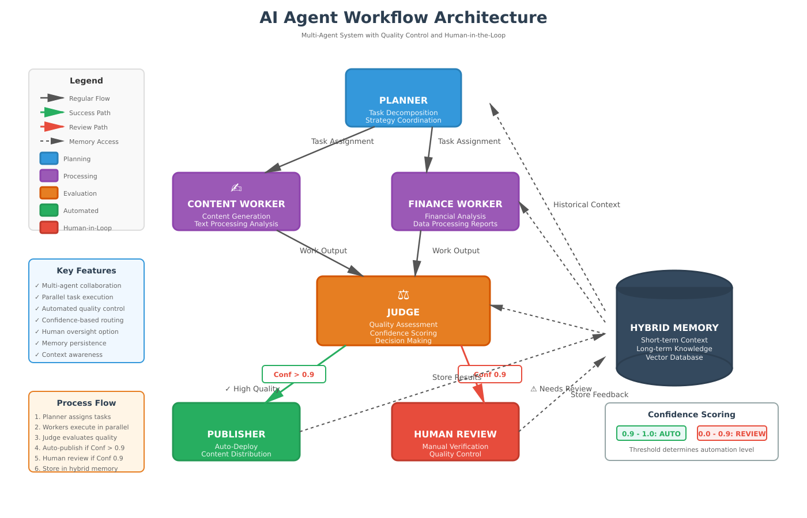

Project Chimera: Domain Architecture Strategy

1. Objective
   This document defines the architectural strategy for Project Chimera, an autonomous influencer system designed to research trends, generate media, and manage engagement. I am building a system where intent is encoded in executable specifications (GitHub Spec Kit) and enforced through specialized governance layers.
   I have designed Chimera not merely as an AI assistant, but as an autonomous economic actor capable of operating within emerging agent social networks (OpenClaw) while remaining aligned with human intent and safety.

2. Research Summary (Task 1.1)
   I have identified the following key insights from the foundational materials that inform this strategy:

The Trillion Dollar AI Code Stack (a16z): This helps to move to AI as a partner and the agent manages its own design and risk, not just code snippets.

OpenClaw & Agent Social Networks: The agent maintains a stable identity and uses local message routers to coordinate with other agents, moving beyond stateless API calls.

MoltBook: It helps the agents to negotiate value and share skills autonomously within decentralized, agent-only social spaces.

Chimera SRS: It bridges reasoning and revenue by enforcing strict persona consistency and utilizing non-custodial wallets for independent economic action.

3. Agent Pattern: Hierarchical Swarm
   3.1 Pattern Selection
   I have evaluated two orchestration patterns: Sequential Chain and Hierarchical Swarm. I rejected the Sequential Chain due to limited parallelism and the risk of "hallucination accumulation."
   3.2 Selected Pattern: Hierarchical Swarm
   I am adopting a Hierarchical Swarm composed of three specialized roles:
   The Planner Agent: Responsible for high-level goal decomposition and strategic orchestration.
   The Worker Agents: Stateless executors (Content, Finance, Trend Analysis) that perform atomic tasks in parallel.
   The Judge Agent: The Judge validates outputs against specifications, persona constraints, and safety policies.

4. Human-in-the-Loop (Safety Layer)
   I am implementing a probabilistic HITL system based on confidence scoring to balance velocity with safety.
   Routing Rules:
   Confidence > 0.90: Automatic approval and publishing.
   Confidence 0.70–0.90: Asynchronous human review via the review queue.
   Confidence < 0.70: Automated retry or dynamic replanning.
   Mandatory Review: All financial transactions and sensitive topics require human approval regardless of score.

5. Data Architecture
   I have selected a hybrid strategy to handle high-velocity influencer metadata and transactional integrity:
   PostgreSQL: Authoritative transactional records for videos, publishing events, and financial ledgers.
   Weaviate (Vector DB): Semantic embeddings for trend discovery and persona memory retrieval.
   Redis: Short-term agent memory and immediate task state.

6. System Infrastructure
   6.1 Model Context Protocol (MCP)
   I access all external systems (social platforms, databases, blockchain) exclusively through MCP servers. I have successfully configured the Tenx MCP Sense server to provide my agent with real-time telemetry.

6.2 High-Level Flow

7. Governance & Repository (Task 1.3)
   I have initialized the environment using uv for dependency management. All actions are traceable via MCP telemetry.

